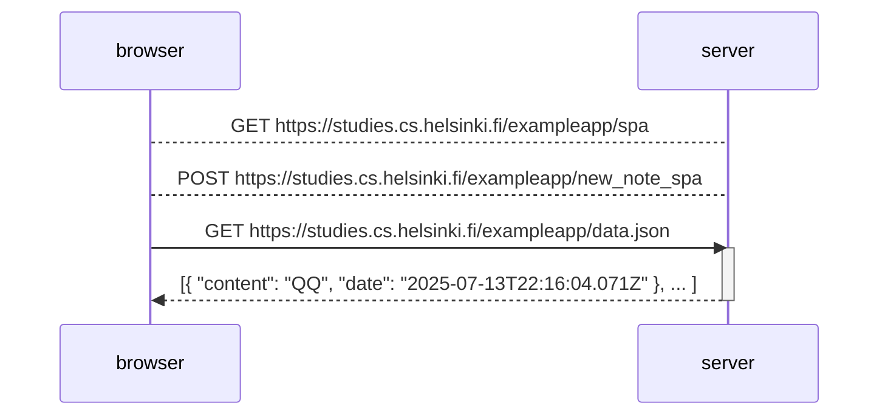

```mermaid
sequenceDiagram
    participant browser
    participant server
    
    browser --> server: GET https://studies.cs.helsinki.fi/exampleapp/spa

   browser --> server: POST https://studies.cs.helsinki.fi/exampleapp/new_note_spa
 
    browser->>server: GET https://studies.cs.helsinki.fi/exampleapp/data.json
    activate server
    server-->>browser: [{ "content": "QQ", "date": "2025-07-13T22:16:04.071Z" }, ... ]
    deactivate server

```
