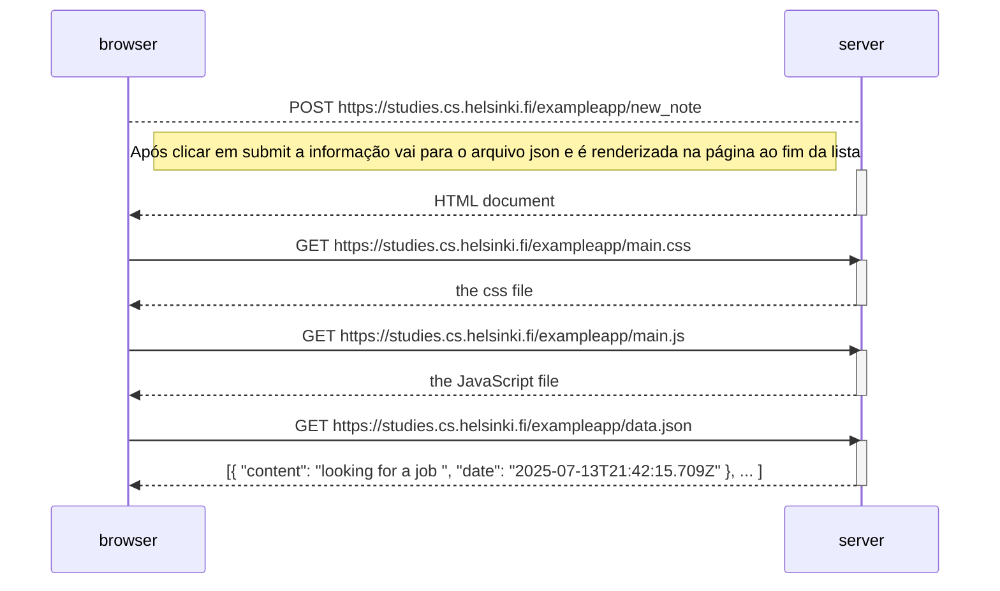

```mermaid
sequenceDiagram
    participant browser
    participant server
    browser --> server: POST https://studies.cs.helsinki.fi/exampleapp/new_note
Note right of browser: Após clicar em submit a informação vai para o arquivo json e é renderizada na página ao fim da lista

    activate server
    server-->>browser: HTML document
    deactivate server

    browser->>server: GET https://studies.cs.helsinki.fi/exampleapp/main.css
    activate server
    server-->>browser: the css file
    deactivate server

    browser->>server: GET https://studies.cs.helsinki.fi/exampleapp/main.js
    activate server
    server-->>browser: the JavaScript file
    deactivate server

    browser->>server: GET https://studies.cs.helsinki.fi/exampleapp/data.json
    activate server
    server-->>browser: [{ "content": "looking for a job ", "date": "2025-07-13T21:42:15.709Z" }, ... ]
    deactivate server

```
